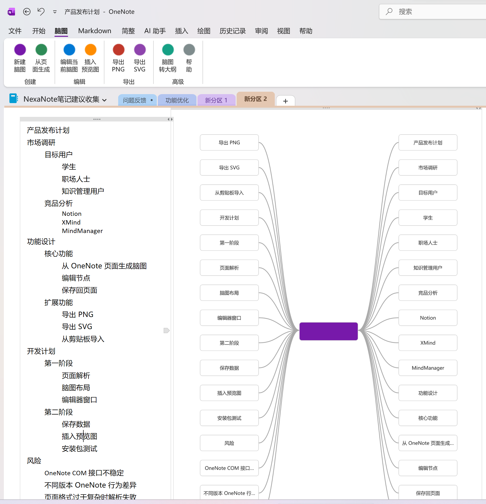
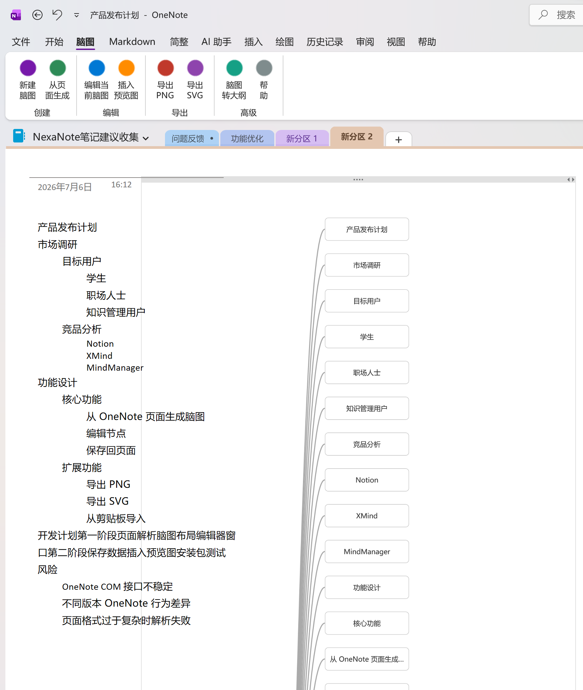
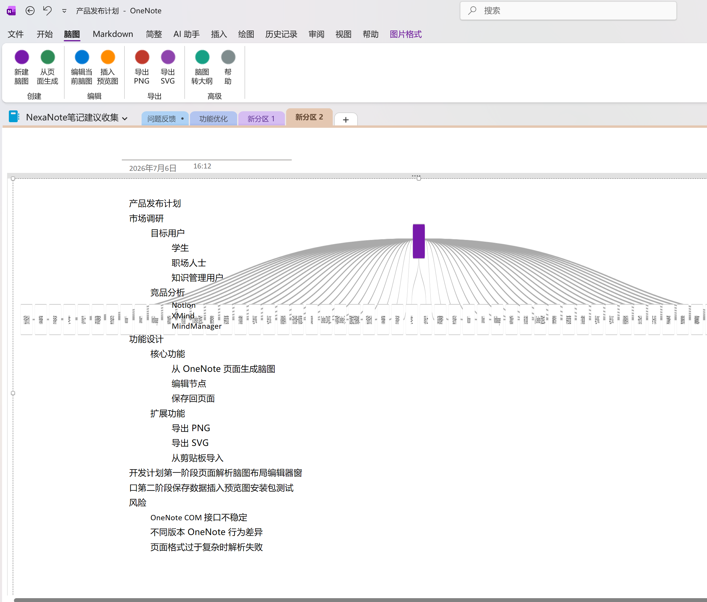
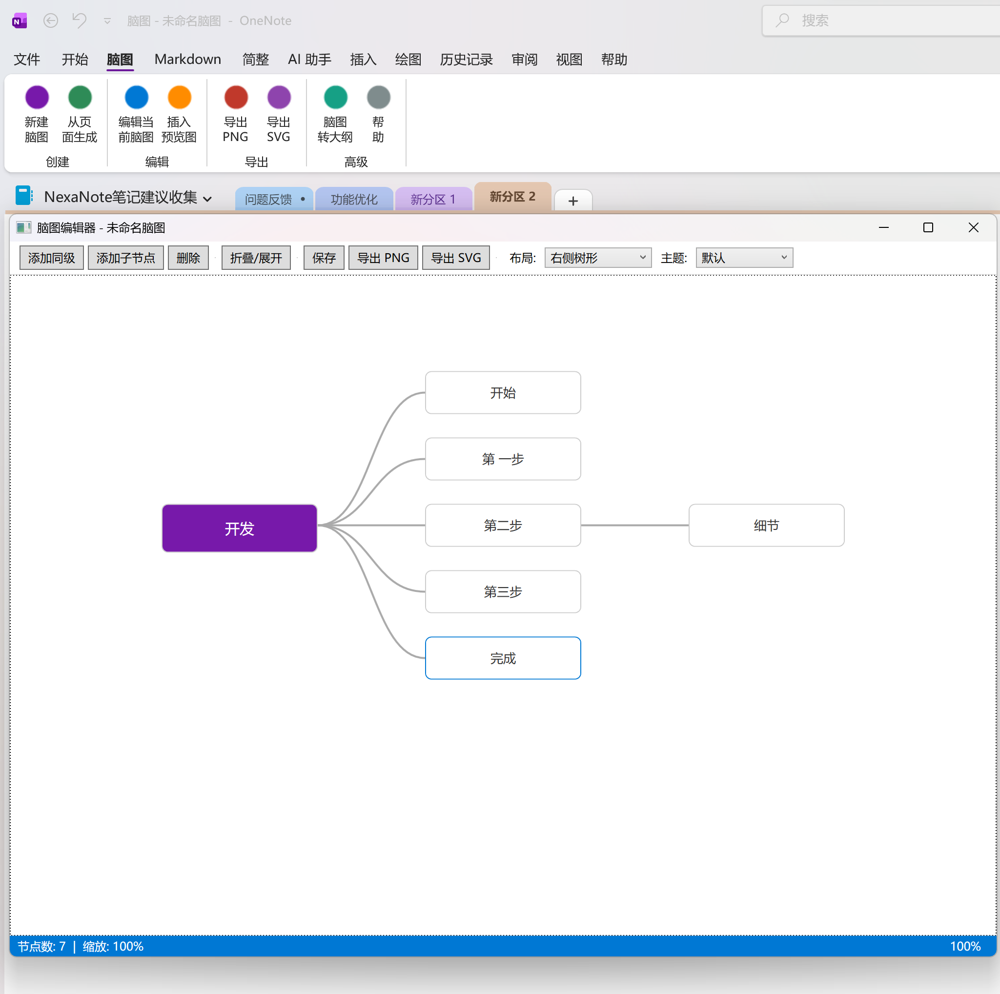

# OneNote MindMap (脑图)

[English](README.md) | **中文**

**OneNote 脑图** 是一款 Microsoft OneNote COM 插件，可以将 OneNote 页面转换为可编辑的思维导图，也可以将思维导图还原为 OneNote 页面大纲。它提供独立的 WPF 编辑器，支持多种布局、主题和节点形状——无需 AI、无需联网，完全离线使用。

## 功能介绍

### 从页面到脑图
- **从页面生成** — 解析 OneNote 页面的大纲层级结构，自动生成思维导图
- **编辑脑图** — 打开 WPF 编辑器，拖拽、添加、删除和编辑节点
- **保存** — 将脑图数据以隐藏 Meta 标记写入页面（不污染可见内容）

### 从脑图到页面
- **转为大纲** — 将思维导图还原为 OneNote 大纲结构
- **插入预览** — 导出思维导图为 PNG 预览图并插入页面

### WPF 编辑器
- **三种布局**：右树、对称、组织架构
- **五种主题**：默认、紫色、简约、清新、温暖
- **三种节点形状**：圆角、矩形、胶囊
- **导出**：支持导出为 PNG 或 SVG

### 功能区按钮（共 8 个）

| 按钮 | 功能 |
|------|------|
| **新建** | 创建一个新的空白脑图 |
| **生成** | 将当前页面内容解析为脑图 |
| **编辑** | 打开 WPF 编辑器编辑当前脑图 |
| **大纲** | 将脑图转换为 OneNote 大纲文本 |
| **插入预览** | 插入/更新脑图的 PNG 预览图 |
| **导出 PNG** | 将脑图导出为 PNG 文件 |
| **导出 SVG** | 将脑图导出为 SVG 文件 |
| **帮助** | 查看使用说明 |

## 截图

| 功能区 | 编辑器 |
|--------|--------|
|  |  |

| 布局 | 主题 |
|------|------|
|  |  |

## 系统要求

- Windows 7 或更高版本
- Microsoft OneNote 2013 / 2016 / 2019 / Microsoft 365（桌面版）
- .NET Framework 4.8

## 安装

1. 从 [Releases](https://github.com/oldding/OneNoteMindMap/releases) 下载安装程序
   - 64 位 OneNote 选择 `OneNoteMindMapSetup-1.4.1-x64.exe`
   - 32 位 OneNote 选择 `OneNoteMindMapSetup-1.4.1-x86.exe`
2. 运行安装程序（需要管理员权限）
3. 重启 OneNote
4. 在功能区可以看到新的 **脑图** 选项卡

## 从源码构建

```powershell
.\build.ps1
```

需要：
- Visual Studio 2022 Build Tools（或完整版 VS）with MSBuild
- Inno Setup 6（ISCC.exe 需在 PATH 中）

## 项目结构

```
src/
├── OneNoteMindMap.Core/          # 核心库（模型、布局、序列化、解析）
│   ├── Layout/                   # 布局引擎（右树、对称、组织架构）
│   ├── Model/                    # 脑图文档、节点、设置
│   ├── Parsing/                  # 从 OneNote XML 解析脑图
│   ├── Rendering/                # SVG 渲染器、主题定义
│   └── Serialization/            # JSON 编解码、序列化
├── OneNoteMindMap.AddIn/         # COM 插件 DLL
│   ├── AddIn/                    # 入口（Connect.cs, RibbonHandler.cs）
│   ├── Features/                 # 8 个功能命令实现
│   ├── OneNote/                  # OneNote COM 交互（提供者、解析、写入、存储）
│   ├── UI/                       # UI 辅助与多语言字符串
│   ├── Logging/                  # 文件日志
│   └── Ribbon/                   # 自定义 Ribbon XML 与图标
├── OneNoteMindMap.Editor/        # WPF 脑图编辑器
│   ├── MindMapEditorWindow.xaml  # 主编辑器窗口
│   ├── NodeControl.xaml          # 节点 UI 控件
│   ├── MindMapEditorViewModel.cs # 视图模型
│   ├── LinkGeometryBuilder.cs    # 连接线几何
│   └── PngExporter.cs            # WPF RenderTargetBitmap 导出
└── OneNoteMindMap.Installer/     # Inno Setup 安装脚本
```

## 技术栈

- **语言**: C# 9.0
- **框架**: .NET Framework 4.8
- **运行时**: COM Add-in (IDTExtensibility2 + IRibbonExtensibility)
- **OneNote 交互**: Microsoft.Office.Interop.OneNote (v15.0)
- **WPF**: PresentationFramework, RenderTargetBitmap
- **JSON**: 内置轻量 JSON 序列化器（无外部依赖）
- **安装**: Inno Setup 6（x86/x64）
- **构建**: Visual Studio 2022+ / MSBuild

## 许可证

[MIT](LICENSE) © 2026 OneNoteMindMap Contributors
