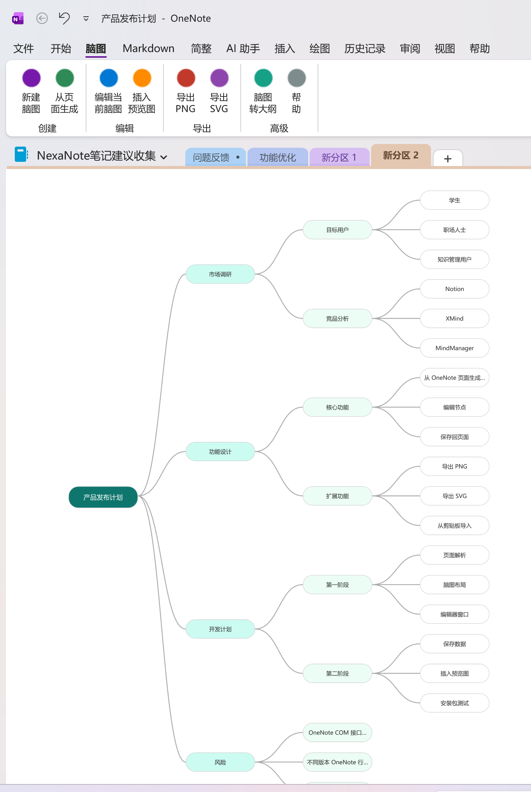
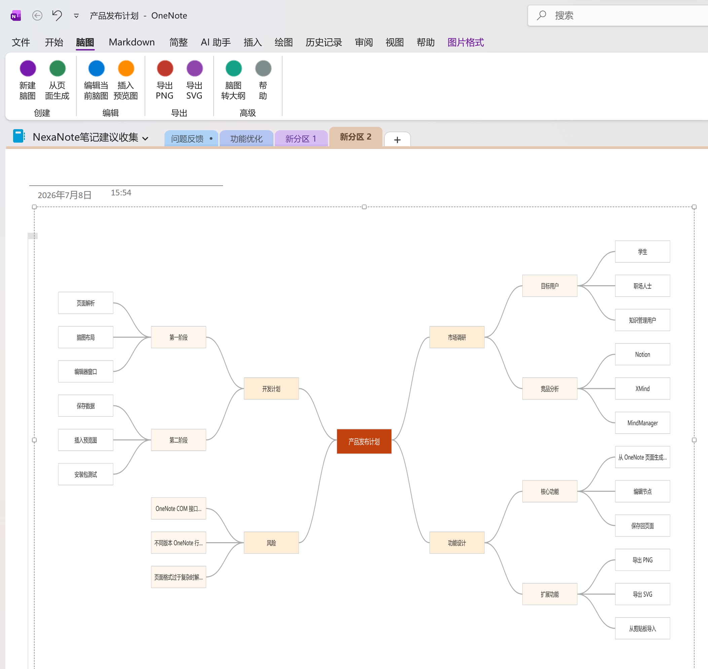
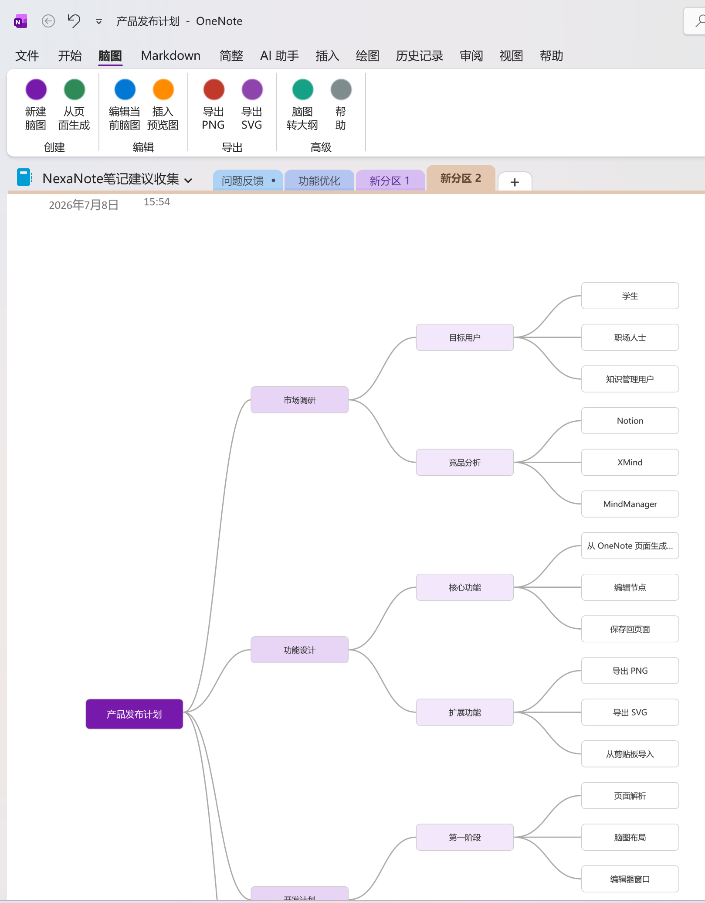

# OneNote 终于能直接做思维导图了：OneNote MindMap 正式发布

> 把 OneNote 页面一键转换成可编辑的思维导图，也可以把脑图还原为页面大纲。无需 AI、无需联网，完全离线使用。

如果你长期使用 OneNote，可能遇到过这样的情况：

笔记越写越长，大纲层级也越来越多。文字适合记录细节，但当你想快速看清一篇笔记的整体结构、梳理知识之间的关系，或者向别人展示自己的思路时，单纯的大纲就显得不够直观。

为了解决这个问题，我们开发了 **OneNote MindMap**。

现在，它正式发布并开源了。

OneNote MindMap 是一款面向 Microsoft OneNote 桌面版的思维导图插件。它不要求你改变原来的笔记习惯，也不用把内容复制到另一款软件中：在 OneNote 里写好大纲，点击一次按钮，就能生成一张思维导图。

*图：OneNote 页面内容与生成后的思维导图*

---

## 从页面到脑图，只需一次点击

安装插件后，OneNote 功能区会出现一个新的 **“脑图”** 选项卡。

其中包含新建脑图、从页面生成、编辑当前脑图、插入预览图、导出 PNG、导出 SVG、脑图转大纲等常用功能。

当页面中已经有按层级整理好的大纲时，点击 **“从页面生成”**，插件会读取页面的大纲关系，并自动建立相应的脑图节点。

原来的一级内容、二级内容和更深层级，会自然转换成父节点与子节点。你不需要重新录入，也不必手动搭建结构。

*图：左侧是原始大纲，右侧是自动生成的思维导图*

这意味着，你可以继续用最熟悉的方式在 OneNote 中记录内容，再在需要梳理全局时，把它切换成更直观的脑图视图。

---

## 它不是一张静态图片，而是一张可以继续编辑的脑图

生成脑图之后，可以打开独立编辑器继续调整。

你可以在编辑器中：

- 添加同级节点或子节点
- 删除节点
- 双击修改节点文字
- 折叠或展开分支
- 拖动节点调整顺序
- 保存修改并写回当前 OneNote 页面

*图：独立脑图编辑器，可继续增删和修改节点*

脑图数据会保存在当前 OneNote 页面中，不需要另外管理一个项目文件。下次打开页面时，仍然可以继续编辑原来的脑图。

---

## 三种布局，让不同内容找到合适的表达方式

不同类型的内容，适合不同的结构。

OneNote MindMap 目前提供三种布局：

1. **右侧树形**：适合读书笔记、课程提纲、工作拆解等由主到次的内容。
2. **两侧分布**：适合知识总结、项目规划和需要兼顾多个方向的主题。
3. **组织结构图**：适合层级关系、团队架构和流程分解。

*图：右侧树形布局*

*图：两侧分布布局*

你可以根据内容类型随时切换布局，不必重新创建节点。

---

## 多种主题与节点样式

除了结构，脑图的视觉风格也可以调整。

插件内置 **默认、紫色、简约、清新、暖色** 五种主题，以及 **圆角、矩形、胶囊** 三种节点形状。无论是个人笔记、学习资料还是工作汇报，都可以选择更适合的呈现方式。

*图：紫色主题效果*

---

## 脑图也可以回到 OneNote 大纲

OneNote MindMap 不只是“从文字生成图片”。

如果你习惯先用脑图发散思考，也可以在编辑完成后点击 **“脑图转大纲”**，把节点结构重新转换成 OneNote 的层级大纲。

整个工作流是双向的：

**OneNote 页面大纲 → 可编辑脑图 → OneNote 页面大纲**

你可以用大纲记录细节，用脑图观察结构，在两种表达方式之间自由切换。

---

## 支持插入预览图，也支持导出 PNG 和 SVG

完成脑图后，可以将预览图直接插入当前 OneNote 页面，让文字内容和结构图保存在一起。

如果需要放进报告、课件、文章或演示文稿，还可以导出为：

- **PNG**：适合直接分享、插入文档或发送给他人
- **SVG**：适合需要无损缩放或继续设计加工的场景

这样，OneNote 里的笔记不仅可以自己看，也能方便地用于交流和展示。

---

## 无需 AI，无需云端，完全离线

OneNote MindMap 的页面解析、脑图编辑、数据保存和图片导出都在本地完成。

它不需要接入 AI 服务，不要求登录第三方账号，也不会把笔记内容上传到云端。对于学习笔记、工作材料以及不方便上传到外部服务的内容，可以更安心地使用。

---

## 谁适合使用？

如果你属于下面这些人，OneNote MindMap 可能会很适合你：

- 用 OneNote 整理读书笔记和课程内容
- 需要梳理项目计划、需求或会议记录
- 习惯先写大纲，再观察整体结构
- 希望在 OneNote 内完成记录与可视化，不想来回切换软件
- 更重视离线使用和数据隐私

---

## 下载与安装

### 官网下载

[https://nexanote.cn/download/](https://nexanote.cn/download/)

### GitHub 开源地址

[https://github.com/oldding/OneNoteMindMap](https://github.com/oldding/OneNoteMindMap)

项目采用 **MIT 许可证**开源。欢迎查看源码、提交 Issue，也欢迎参与改进。

安装时请注意：

1. 根据 **OneNote 的位数**选择 x64 或 x86 安装包，而不是根据 Windows 的位数选择。
2. 运行安装程序时需要管理员权限。
3. 安装完成后重新启动 OneNote。
4. 在功能区看到 **“脑图”** 选项卡，即表示安装成功。

目前支持：

- Windows 7 或更高版本
- OneNote 2013 / 2016 / 2019
- Microsoft 365 OneNote 桌面版
- .NET Framework 4.8

---

## 写在最后

OneNote 的优势一直是自由、稳定，以及适合长期积累；思维导图的优势则是直观，能够帮助我们快速看见结构。

OneNote MindMap 想做的，就是把这两种能力连接起来：

**让笔记不只能够被记录，也能够被重新组织和看见。**

如果你正在使用 OneNote，欢迎下载体验。使用过程中遇到问题，或者对后续功能有建议，可以在 GitHub Issues 中告诉我们。

也欢迎把这篇文章分享给身边仍在使用 OneNote 的朋友。

---

**OneNote MindMap**

官网：[https://nexanote.cn/download/](https://nexanote.cn/download/)

GitHub：[https://github.com/oldding/OneNoteMindMap](https://github.com/oldding/OneNoteMindMap)

